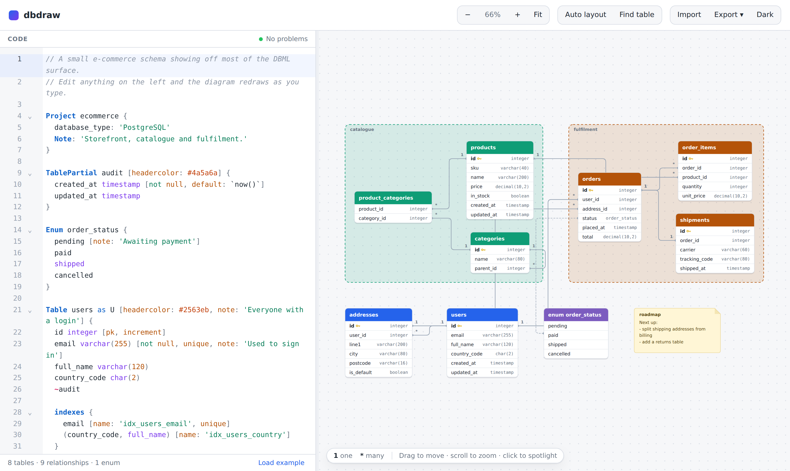

# dbdraw

Draw entity-relationship diagrams by writing code. You type [DBML][dbml] in the
left pane, the diagram redraws in the right pane as you type — the same idea as
[dbdiagram.io][dbdiagram], built from scratch here.



Everything runs in the browser. There is no server, no account, and nothing
leaves your machine — your schema is autosaved to `localStorage` and exports
are ordinary file downloads.

## Quick start

```bash
npm install
npm run dev      # http://localhost:5173
```

Other scripts:

| Command | What it does |
| --- | --- |
| `npm run build` | Type-check and build a static site into `dist/` |
| `npm run preview` | Serve the built site |
| `npm test` | Run the unit tests |
| `npm run typecheck` | Type-check only |

## What it does

**Editor**

- DBML syntax highlighting, bracket matching and code folding
- Context-aware autocomplete — block keywords at the top level, column types
  inside a table, setting names inside `[ … ]`, table names after `Ref:`, and
  column names after `table.`
- Errors and warnings underlined in place, with a gutter marker and the exact
  message from the compiler
- Multi-cursor, search-and-replace, undo history (standard CodeMirror keys)

**Diagram**

- Automatic layout that never overlaps two tables, recomputed deterministically
  on every keystroke
- Drag tables anywhere; positions persist and relationships re-route live
- Pan (drag the canvas), zoom (scroll, or `Ctrl`/`Cmd` `+` `-` `0`), fit to
  screen (double-click the background)
- Click a table or column to spotlight its relationships and fade out the rest
- Click the diagram to jump to that line of code; move the cursor in the code to
  spotlight the matching element
- Table groups drawn as labelled containers, sticky notes, per-table header
  colours, enum boxes linked to the columns they type
- Hover anything for a tooltip with its note, type, flags and indexes
- Find-a-table panel (`Ctrl`/`Cmd` `F` when the diagram has focus)
- Light and dark themes

**Import and export**

- Export the diagram as **SVG** (self-contained — styles are embedded, so it
  looks the same anywhere) or **PNG** at 2× resolution
- Export **PostgreSQL** or **MySQL** DDL, or the raw `.dbml`
- Import a `.dbml` file, or a `.sql` schema dump which is converted to DBML

## DBML support

The whole language as documented in the [DBML spec][dbml] is implemented:

```dbml
Project shop {
  database_type: 'PostgreSQL'
  Note: 'Anything you like'
}

// Reusable column sets, injected with `~`
TablePartial audit {
  created_at timestamp [not null, default: `now()`]
  updated_at timestamp
}

Enum order_status {
  pending [note: 'Awaiting payment']
  shipped
}

Table ecommerce.users as U [headercolor: #2563eb, note: 'Everyone with a login'] {
  id integer [pk, increment]
  email varchar(255) [not null, unique, note: 'Used to sign in']
  role varchar [default: 'member']
  tags text[]
  ~audit

  indexes {
    email [name: 'idx_users_email', unique]
    (country_code, full_name)
    `lower(email)` [type: hash]
  }

  Note: '''
    Triple quotes give you a multi-line note,
    dedented for you.
  '''
}

Table orders {
  id integer [pk]
  user_id integer [ref: > U.id]        // inline relationship
  status order_status
}

Ref: orders.id < order_items.order_id                  // one to many
Ref: orders.user_id > users.id [delete: cascade]       // many to one
Ref: shipments.order_id - orders.id                    // one to one
Ref: products.id <> categories.id                      // many to many
Ref: periods.(merchant_id, country) > merchants.(id, country)  // composite

TableGroup fulfilment [color: #b45309] {
  orders
  shipments
  Note: 'What we owe people'
}

Note roadmap {
  'Sticky notes live on the canvas'
}
```

Also supported: schema-qualified names (`ecommerce.users`), `"quoted names"`
with spaces, `//` and `/* */` comments, and aliases used anywhere a table name
is expected.

### Relationship notation

Connectors are labelled the way dbdiagram does it — `1` and `*` at each end:

| DBML | Meaning | Left · Right |
| --- | --- | --- |
| `<` | one to many | `1` · `*` |
| `>` | many to one | `*` · `1` |
| `-` | one to one | `1` · `1` |
| `<>` | many to many | `*` · `*` |

## How it fits together

```
src/
  dbml/       the compiler — no DOM, no dependencies
    lexer.ts       tokens, each carrying a source span
    parser.ts      error-tolerant recursive descent -> AST
    analyzer.ts    AST -> resolved schema + diagnostics
    model.ts       the resolved types everything else consumes
  diagram/    turning a schema into a picture
    layout.ts      cluster, layer, then shelf-pack
    routing.ts     orthogonal edge routing anchored at column rows
    renderer.ts    SVG building, pan/zoom/drag, spotlight, export
    style.ts       diagram CSS (embedded in the SVG so exports stand alone)
  editor/     CodeMirror integration
    language.ts    DBML stream tokenizer + highlight style
    completion.ts  context-aware suggestions
    editor.ts      the code pane and the two-way code↔diagram link
  sql/        export.ts (DBML -> DDL) and import.ts (DDL -> DBML)
  app/        persistence and downloads
  main.ts     wires it all together
```

Two decisions worth knowing about:

**The parser recovers instead of giving up.** A half-typed table is the normal
state of a live editor, so a bad line produces a diagnostic and is skipped
while everything around it still compiles and renders. Errors inside a table
body are contained to their own line.

**The diagram's styles live inside the SVG.** `diagram/style.ts` is injected as
a `<style>` element in the SVG rather than the page stylesheet, which is what
makes an exported `.svg` look identical when opened anywhere else.

## Tests

```bash
npm test
```

61 unit tests cover the lexer, parser and analyzer (including error recovery
and every relationship form), layout invariants (no overlaps, determinism,
group containment), edge routing, SQL export for both dialects, SQL import
including a round-trip back through the compiler, and the editor's completion
context. The browser behaviour — dragging, spotlight, exports, theme
switching — was verified by driving the built app with Playwright.

## Limitations

- SQL import understands schema DDL (`CREATE TABLE`, `ALTER TABLE … ADD
  CONSTRAINT`, `CREATE INDEX`, `CREATE TYPE … AS ENUM`, `COMMENT ON`). Other
  statements are skipped and counted in the toast.
- `<>` many-to-many relationships are drawn but not exported to SQL, since they
  need a join table that isn't in the schema.
- `CHECK` constraints are parsed but neither drawn nor exported.

[dbml]: https://dbml.dbdiagram.io/docs/
[dbdiagram]: https://dbdiagram.io/
