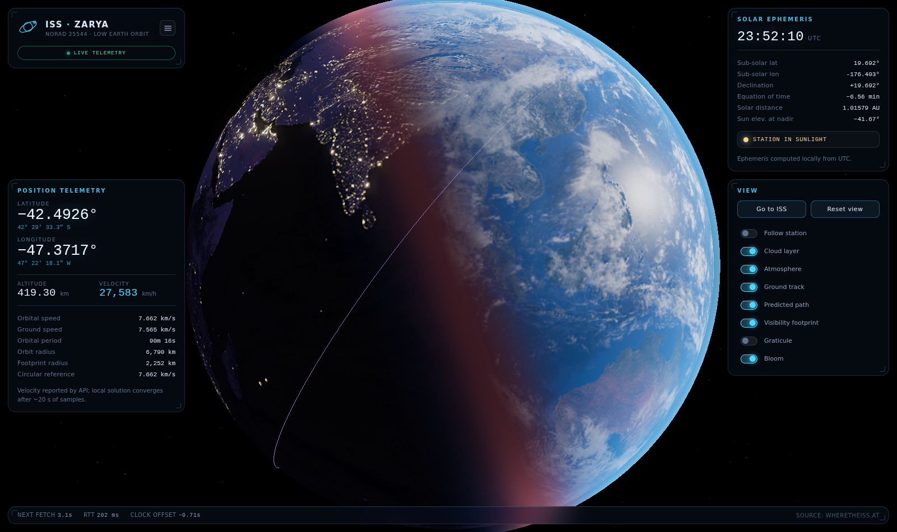

# ISS Orbital Tracker

A real-time 3D tracker for the International Space Station. A Blue Marble globe
lit by a genuine solar ephemeris, with the station's live position pulled from
the [Where The ISS At](https://wheretheiss.at/w/developer) API every five seconds.



Everything runs client-side. three.js and all imagery are vendored into the
repository, so the only network request the page makes at runtime is the
telemetry fetch itself.

## Running it

The page uses ES modules and an import map, so it has to be served over HTTP —
opening `index.html` from the filesystem will not work.

```bash
npm start                 # python3 -m http.server 8000
# then open http://localhost:8000
```

Any static server will do. There is nothing to build and no dependencies to
install.

## What it actually computes

Three things in this project are easy to fake and easy to get invisibly wrong,
so each is derived rather than approximated.

### The terminator is a real ephemeris, not a rotating light

`src/astro/solar.js` implements the Astronomical Almanac's low-precision solar
position algorithm. From the current UTC instant it computes the solar
declination, the equation of time, and from those the **sub-solar point** — the
latitude and longitude where the Sun is exactly overhead. The scene's key light
is aimed along that direction every frame.

That means the day/night terminator falls on the correct real-world meridian,
the polar day/night regions tilt correctly with the season, and the equation of
time (up to ±16 minutes, or 4° of longitude) is accounted for rather than
ignored.

The panel also cross-checks the locally computed sub-solar point against the one
the API reports, and displays the disagreement — so the claim is auditable in
the UI rather than merely asserted.

### The station sits on the right pixel

The Earth is a stock `THREE.SphereGeometry` carrying an equirectangular texture,
and it never rotates — scene space *is* the Earth-fixed frame. `src/astro/geo.js`
maps latitude/longitude into that frame using the exact convention three.js uses
to lay out sphere UVs, so the marker lands on the same point of the globe that
the texture puts that coordinate on.

Latitude is used **as reported** (geodetic/WGS84). Equirectangular Blue Marble
maps are themselves plotted in geodetic latitude, so converting to geocentric
would introduce up to ~21 km of error *relative to the imagery underneath the
marker*. Altitude is true to scale: 420 km against a 6371 km radius.

The marker's own size is not to scale, and could not be — the station is about
1/60000th of an Earth radius across, so a scale model would be sub-pixel. It is
drawn as a beacon that holds a roughly constant apparent size across zoom levels.

### Velocity is measured, not just relayed

Between fetches the station is dead-reckoned. Rather than sliding along a great
circle — which is wrong in a rotating frame — `GroundTrackPropagator` converts
the observed Earth-fixed motion into inertial motion by adding back Earth's
spin, advances along the inertial great circle, then de-rotates. This reproduces
the westward walk of each successive ground track, and drives both the trailing
history and the forward prediction line.

Angular velocity is differenced over a **90-second baseline**, not between
adjacent 5-second samples. The API stamps positions to whole seconds, and over a
5-second gap that quantisation would dominate: worst case ~19% error on the
derived speed, versus ~1% at 90 seconds. `npm test` prints the full trade-off
table. The HUD shows the locally derived speed alongside its disagreement with
the API's own figure.

Two smaller details that matter for accuracy:

- **Clock skew.** Positions carry the *server's* timestamp. Dead-reckoning
  against a client clock even a few seconds off would displace the station by
  ~7.7 km per second of error, so an NTP-style offset is estimated from each
  round trip and used for all propagation. The current offset is shown in the
  status bar.
- **Feed health is judged on fix age, not request success.** A dead-reckoned
  position stays trustworthy for a while after the feed drops, so the link badge
  distinguishes `LIVE` from `DEAD RECKONING` from `SIGNAL LOST`, and the beacon
  shifts from cyan to amber while the fix is stale.

## Controls

Drag to orbit, scroll to zoom. **Go to ISS** swings the camera to the station,
**Follow station** keeps it centred while preserving your zoom, and the ☰ button
in the masthead collapses the panels for an unobstructed view.

Toggles: cloud layer, atmosphere, ground track, predicted path, visibility
footprint, 15° graticule, bloom.

## Rendering notes

- **Day/night.** A single `MeshStandardMaterial` with injected shader chunks.
  City lights are revealed across the twilight band by the sun angle rather than
  snapping on at the geometric terminator; the bundled specular map is inverted
  in-shader so oceans are smooth enough to throw a sun-glint while land stays
  matte.
- **Atmosphere.** A Fresnel shell whose optical depth includes a base term, not
  just a limb term. That base is what makes the oceans read blue — open water
  has an albedo of a few percent, and it is Rayleigh scattering above it, not
  the water itself, that colours the planet from orbit. Without it the seas
  render nearly black.
- **Bloom.** `UnrealBloomPass` with the threshold just above 1.0, so only
  genuinely over-bright pixels bloom: the beacon core, the Sun, and ocean glint.
  Outgoing radiance from the globe is clamped in-shader — grazing-angle specular
  spikes by orders of magnitude at the sunlit limb, and left unclamped it
  overflows the half-float bloom targets, where a single non-finite texel
  poisons every level of the mip pyramid and shows up as hard nested squares.

## Tests

```bash
npm test
```

Checks the ephemeris against published equinox and solstice instants, the
equation-of-time extrema, and perihelion/aphelion distances; verifies the
coordinate mapping against the UVs three.js actually generates (rather than
against the same formula twice); and verifies the propagator recovers the period
and speed of a closed-form two-body orbit, with bounded dead-reckoning error.

The UI was verified in headless Chromium across desktop, mobile, offline and
extreme-zoom cases.

## Layout

```
index.html              markup, import map
styles/app.css          glass HUD
src/main.js             scene setup and render loop
src/astro/solar.js      solar ephemeris, sub-solar point
src/astro/geo.js        coordinate mapping, ground-track propagator
src/data/issFeed.js     fetch loop, clock sync, velocity differencing
src/scene/              earth, starfield, beacon
src/ui/hud.js           DOM bindings
tests/verify.mjs        numerical verification
vendor/three/           three.js r160 + addons
assets/textures/        Blue Marble imagery
```

`window.issTracker` exposes the scene, camera and feed for console inspection.

## Limitations

- Position comes from the API; nothing is propagated from TLEs, so a prolonged
  outage eventually means a stale fix rather than a degraded-but-independent
  solution.
- The forward prediction is a single Keplerian arc — it ignores J2 and drag, so
  it drifts from truth over a full orbit. It is a visualisation aid, not a pass
  predictor.
- The `visibility` (sunlit / eclipsed) flag is taken from the API rather than
  derived from the station's own solar geometry.

## Credits

Telemetry from [wheretheiss.at](https://wheretheiss.at). Earth imagery from the
three.js example assets, derived from NASA's Blue Marble and Earth at Night
collections. Rendering with [three.js](https://threejs.org) r160 (MIT).
